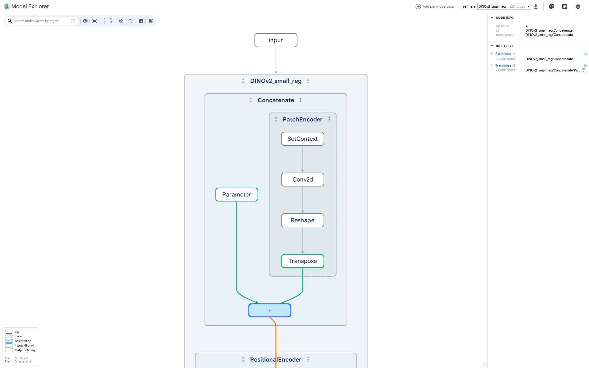

# Refiners Model Explorer

A [Model Explorer](https://github.com/google-ai-edge/model-explorer) extension to visualize and explore refiners models.



## Installation

```bash
pip install git+https://github.com/Laurent2916/model-explorer-refiners
```

## Usage

```python
from refiners.foundationals.dinov2 import DINOv2_small_reg
from model_explorer_refiners import RefinersAdapter

model = DINOv2_small_reg()
RefinersAdapter.visualize(model)
```
